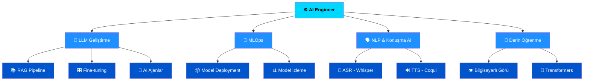

<div align="center">


<br>

[](https://github.com/Emrecaglar05)
[](https://github.com/Emrecaglar05)
[](https://www.linkedin.com/in/emre-%C3%A7a%C4%9Flar-9bb493294/)
[](https://www.kaggle.com/emrecaglar05)
[](mailto:emrecaglar05@gmail.com)

</div>

---

## 🧠 Hakkımda


```python
class AIEngineer:
    def __init__(self):
        self.ad       = "Emre Çağlar"
        self.rol      = "AI Engineer (Geliştirici Aday)"
        self.konum    = "Bandırma, Balıkesir 🇹🇷"
        self.egitim   = "Yönetim Bilişim Sistemleri @ BANÜ"

        self.uzmanlık = [
            "🔭 LLM Fine-tuning & RAG Pipeline",
            "🧠 Derin Öğrenme Mimarileri",
            "🗣️ NLP & Konuşma Tanıma (ASR/TTS)",
            "⚙️  MLOps & Model Deployment",
            "🤖 Otonom AI Ajan Sistemleri",
        ]

    def misyon(self) -> str:
        return (
            "Ham veriden prodüksiyona hazır, ölçeklenebilir "
            "AI sistemleri inşa etmek; insanların hayatına "
            "değer katan zekâ çözümleri üretmek. 🚀"
        )

    def guncel_calisma(self):
        return {
            "🔭 Proje"    : "LLM Hub — haftalık LLM deneyleri",
            "📦 Stack"    : "LangChain · HuggingFace · FastAPI",
            "🌱 Odak"     : "RAG, Agent Frameworks, MLOps",
            "🤝 Topluluk" : "GMTİD Gönüllüsü",
        }
```

<br clear="right"/>

---

## ⚙️ AI Mühendisi Teknoloji Yığını

<div align="center">

### 🔭 Büyük Dil Modelleri & AI Çatıları


### 🧠 Derin Öğrenme & ML


### 🗣️ NLP & Konuşma AI


### 🚀 MLOps & Deployment


### 💻 Programlama & Veri


</div>

---

## 📊 GitHub İstatistikleri

<div align="center">


</div>

---

## 🚀 Öne Çıkan Projeler

<div align="center">

### 🏆 Amiral Gemisi Projeler

<table>
<tr>
<td width="50%" valign="top">

### 🤖 KOMPLI AI
[](https://github.com/Emrecaglar05/KOMPLI_AI)

**YBS Bitirme Projesi** — E-ticaret operasyonlarının Türkiye mevzuatına uygunluğunu otomatik kontrol eden AI sistemi.

`LangChain` `RAG` `FAISS` `FastAPI` `Gemini 2.5` `Next.js`

</td>
<td width="50%" valign="top">

### 🐔 Chicken Disease Classification
[](https://github.com/Emrecaglar05/DataScience-E2E/tree/main/Chicken-Disease-Classification)

**Uçtan Uca MLOps Pipeline** — Derin öğrenme ile tavuk hastalığı sınıflandırması; veri alımından model deploy'una tam E2E akış.

`PyTorch` `CNN` `DVC` `MLflow` `Docker` `FastAPI`

</td>
</tr>
</table>

<br>
---

## 🏗️ AI Mühendisi Uzmanlık Haritası

<div align="center">



</div>

---

## 💡 Yetenek Seviyeleri

<div align="center">

| Alan | İlerleme |
|:---|:---:|
| 📊 **Veri Analizi & ML** |  |
| 🔭 **LLM & Prompt Mühendisliği** |  |
| 🗣️ **NLP & Konuşma AI (ASR/TTS)** |  |
| 🧠 **Derin Öğrenme & Transformers** |  |
| 📚 **RAG Pipeline & Vektör DB** |  |
| 🚀 **MLOps & Model Deployment** |  |
| 🤖 **AI Ajan Sistemleri** |  |

</div>

</div>

## 🌐 Bana Ulaşın

<div align="center">

<a href="mailto:emrecaglar05@gmail.com">
  
</a>
<a href="https://www.linkedin.com/in/emre-%C3%A7a%C4%9Flar-9bb493294/">
  
</a>
<a href="https://www.kaggle.com/emrecaglar05">
  
</a>
<a href="https://github.com/Emrecaglar05">
  
</a>

<br><br>


### 💬 *"Yapay zekâyı anlamak yetmez — onu çalışır, ölçeklenebilir ve insana değer katan sistemlere dönüştürmek gerekir."*

<br>


</div>
