<div align="center">

# 🌟 Emre Çağlar


[](https://github.com/Emrecaglar05)
[](https://github.com/Emrecaglar05)
[](https://www.linkedin.com/in/emre-%C3%A7a%C4%9Flar-9bb493294/)
[](https://www.kaggle.com/emrecaglar05)

</div>

---


### 👨‍💻 About Me

```python
class DataScientist:
    def __init__(self):
        self.name = "Emre Çağlar"
        self.location = "Balıkesir Bandırma, Turkey 🇹🇷"
        self.education = "MIS @ BANÜ"
        self.year = "3rd Year"
        self.passion = [
            "🤖 Artificial Intelligence",
            "📊 Data Analytics", 
            "🗣️ NLP & Speech AI",
            "🧠 Deep Learning"
            " 🔭" LLM 
        ]
    
    def current_status(self):
        return {
            "🔭 working_on": "NLP & Speech Recognition",
            "🌱 learning": "Advanced ML & Deep Learning",
            "🎯 goal": "Data Science Professional",
            "⚡ fun_fact": "I turn coffee into code ☕"
        }
```

<br clear="right"/>

---

<div align="center">

## 🛠️ Technology Arsenal

### **Core Languages**

<table>
<tr>
    <td align="center" width="96">
        
        <br>Python
    </td>
    <td align="center" width="96">
        
        <br>C#
    </td>
    <td align="center" width="96">
        
        <br>SQL
    </td>
</tr>
</table>

### **Data Science & ML**

<table>
<tr>
    <td align="center" width="96">
        
        <br>Pandas
    </td>
    <td align="center" width="96">
        
        <br>NumPy
    </td>
    <td align="center" width="96">
        
        <br>Scikit-learn
    </td>
    <td align="center" width="96">
        
        <br>TensorFlow
    </td>
    <td align="center" width="96">
        
        <br>PyTorch
    </td>
</tr>
</table>

### **Visualization & Tools**

<table>
<tr>
    <td align="center" width="96">
        
        <br>Git
    </td>
    <td align="center" width="96">
        
        <br>GitHub
    </td>
    <td align="center" width="96">
        
        <br>VS Code
    </td>
    <td align="center" width="96">
        
        <br>Docker
    </td>
    <td align="center" width="96">
        
        <br>Jupyter
    </td>
</tr>
</table>

</div>

---

<div align="center">

## 📊 GitHub Analytics


</div>

---

<div align="center">

## 🎯 Skill Progression

**Machine Learning & AI**


**Data Analysis & Visualization**


**Natural Language Processing**


**Deep Learning**


**Database Management (SQL)**


</div>

---

<div align="center">

## 🏆 Featured Projects

<table>
<tr>
<td width="50%">

<h3 align="center">🩺 Breast Cancer Classification</h3>

<div align="center">  
<a href="https://github.com/Emrecaglar05/reast_cancer_classification">

</a>
</div>

**Tech Stack:** `Python` `Scikit-learn` `Pandas` `NumPy`

Advanced machine learning model for medical diagnosis using classification algorithms with high accuracy prediction.

</td>

<td width="50%">

<h3 align="center">📊 Data Analysis Suite</h3>

<div align="center">
<a href="https://github.com/Emrecaglar05/Data-Analysis">

</a>
</div>

**Tech Stack:** `Python` `Pandas` `Matplotlib` `Seaborn`

Comprehensive data analysis projects featuring customer segmentation, revenue prediction, and business intelligence.

</td>
</tr>
</table>

</div>

---

<div align="center">

## 💡 Areas of Expertise

<table>
<tr>
<td width="50%" valign="top">

### 🤖 Machine Learning
- **Supervised Learning**
  - Classification & Regression
  - Random Forest, SVM, XGBoost
- **Unsupervised Learning**
  - K-Means, DBSCAN Clustering
  - PCA, t-SNE
- **Model Optimization**
  - Hyperparameter Tuning
  - Cross-validation
  - Feature Engineering

</td>
<td width="50%" valign="top">

### 🗣️ NLP & Speech AI
- **Text Processing**
  - Tokenization & Lemmatization
  - TF-IDF, Word2Vec
- **Applications**
  - Sentiment Analysis
  - Named Entity Recognition
  - Speech-to-Text (Whisper)
  - Text-to-Speech (Coqui TTS)
- **Tools**
  - NLTK, spaCy, Transformers

</td>
</tr>
</table>

</div>

---

<div align="center">

## 🎓 Certifications & Learning Path

```mermaid
graph LR
    A[🎓 MIS Student] --> B[📊 Data Analytics]
    B --> C[🤖 Machine Learning]
    C --> D[🧠 Deep Learning]
    D --> E[🚀 MLOps]
    C --> F[👁️ Computer Vision]
    C --> G[🗣️ NLP & LLMs]
    
    style A fill:#00D9FF
    style B fill:#00D9FF
    style C fill:#00D9FF
    style D fill:#1E90FF
    style E fill:#1E90FF
    style F fill:#1E90FF
    style G fill:#1E90FF
```



### 🎯 2025 Goals
- ✅ Complete 15+ ML/AI Projects
- ✅ Master MLOps & Model Deployment
- ✅ Contribute to Open Source AI Projects

</div>

---

<div align="center">

## 🌐 Connect With Me

<a href="mailto:emrecaglar05@gmail.com">
  
</a>
<a href="https://www.linkedin.com/in/emre-%C3%A7a%C4%9Flar-9bb493294/">
  
</a>
<a href="https://www.kaggle.com/emrecaglar05">
  
</a>
<a href="https://github.com/Emrecaglar05">
  
</a>

<br><br>


### 💬 *"Data is the new oil, and AI is the engine that refines it into innovation"*


